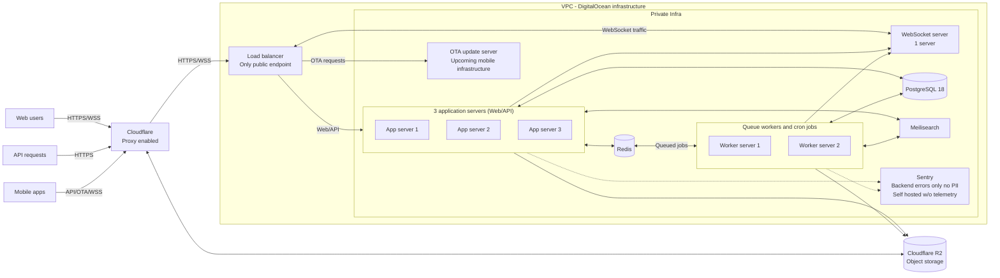

## What PluralSpace is

PluralSpace is an app for plural systems (web, PWA, and mobile soon). It is a monolithic Laravel setup with
InertiaJS and VueJS as the current UI. Mobile apps are being written in CapacitorJS, and use an on-device
encrypted SQLite database for offline support with sync to PluralSpace's API.

PluralSpace helped shape several PluralPort modules. The provisional relationships module for example
was first mapped against PluralSpace's data model and then generalized.

## Infrastructure

PluralSpace runs on a cluster of servers with a load balancer in front of them. 3 servers run the web app, api, feedback 
portal, support portal, and public profiles (public profiles are deprecated, and will be removed in a future release).

2 servers are dedicated to queue workers, which handle background tasks like sending emails, generating exports, and 
processing imports, and any request that would take longer than a few seconds to complete. The queue workers are also 
responsible for generating the ZIP files for exports, and for processing the ZIP files for imports.

This may seem overkill, but it allows PluralSpace to support the ~5.5 million requests per day (~150 million requests per month)
the app receives and the ~16,000 daily active users (1.3-2k concurrent at any time), while still being able to process everything.



## Export shape

A per-system export is a ZIP, with a layout like this:

```
pluralspace-export-2026-09-06.zip
├── manifest.json
├── openplural.json
└── media/
    ├── member-avatar-018f2c3a-....webp
    └── system-banner-018f2c41-....webp
```

The implementation currently uses the legacy OpenPlural naming: `openplural.json` for the document and
`openplural_version` for its version marker. This applies to current exports as well as older ones.
`manifest.json` contains export metadata such as the date, format version, system name, and account email.
Media paths and SHA-256 checksums live in `assets[]` inside `openplural.json`.

A whole-account export contains account-level data plus one document at `systems/{slug}/openplural.json`
and a separate `media/` directory inside each owned system's folder.

An abbreviated example of the current envelope is below. The exporter currently lists only the optional modules
in `capabilities.modules`; the other exported sections are still included in the document.

**NOTE:** Upcoming update will include both `pluralport.json` and `pluralport_version` alongside the legacy OpenPlural fields, 
so that other apps can detect the PluralPort version without needing to rely solely on the legacy OpenPlural fields.

```json
{
  "openplural_version": "0.1",
  "exported_at": "2026-09-06T18:00:00Z",
  "producer": {
    "app": "PluralSpace",
    "app_id": "pluralspace",
    "app_version": "unknown",
    "exporter_version": "0.1"
  },
  "capabilities": {
    "modules": [
      "chat",
      "relationships",
      "polls",
      "boards"
    ]
  },
  "systems": [],
  "members": []
}
```

## Import behaviour

PluralSpace accepts the legacy OpenPlural document shape as a JSON file or a ZIP containing `openplural.json`.
The document must include `openplural_version`; a document containing only `pluralport_version`, or a ZIP
containing only `pluralport.json`, is not currently accepted. A JSON-only import skips bundled media.

Unsupported modules and extension namespaces are not imported. Known unsupported modules and unrecognised
top-level extensions produce warnings, but there is no complete report of every dropped field. The synchronous
importer returns created and skipped counts per step. Queued imports show completion status and warning or error
messages instead of returning a structured PluralPort `ImportResult`.

Records are matched using stored source references, with the file's record ID under the producer's `app_id` as a
fallback identity. Members and groups can also match upstream references from another app. Otherwise PluralSpace
creates new IDs. Matching records are generally skipped rather than updated, so re-importing is not a sync operation.

Fields inside a known record are imported only where PluralSpace has an explicit mapping. Unknown fields and
unsupported extensions are not stored for a later export.

**NOTE:** Upcoming update will look for `pluralport.json` and `pluralport_version` and fall back to the legacy OpenPlural
spec name.

## Known loss

- Chat attachments and message reactions are not exported. Message text and member author references are exported,
  but references to members in systems the exporting user does not own are removed.
- Member profile visibility and field visibility overrides are exported but not restored on import. Only the first
  proxy-tag pair is imported.
- Separate front events and front comments are not imported. Front interval notes are carried on the periods.
- Text, textarea, and link custom-field types all export as text, so their original type distinction is lost.
- Partner-only note and journal visibility becomes trusted. Imports do not restore the source system's visibility
  or public profile.
- Board imports retain body, author, pinned state, and creation time, but do not retain target member, title, or audience.
- Asset support covers member and system avatars and banners, plus the system media library. JSON-only imports
  cannot restore bundled files.
- Unknown fields and unsupported extensions are dropped on import.
- The `relationships` and `polls` modules are still provisional. PluralSpace exports its current field interpretation, 
  which may not match the final v0.1 shape.
- Mood history is not a standard module. It lives in `extensions["pluralspace:moods"]`, so other importers may
  ignore or drop it unless they preserve unsupported extensions.

**NOTE:** We are working on updates that will improve import/export fidelity, preventing as much loss as possible.

## Extensions namespace

Mood history is namespaced under `pluralspace:moods`. Other PluralSpace-specific fields currently use unprefixed
keys inside record-level `extensions`, such as `kind`, `is_pinned`, `profile_visibility`, and `is_multiple`.
The implementation does not yet namespace every app-specific field.

Mood entries describe intervals. A null `member_id` means a whole-system mood, and a null `ended_at` means the
interval is still open:

```json
{
  "extensions": {
    "pluralspace:moods": [
      {
        "id": "018f2c3a-3270-7df0-8a94-74293079c4d1",
        "mood": "content",
        "member_id": null,
        "started_at": "2026-09-01T14:02:00Z",
        "ended_at": null,
        "created_at": "2026-09-01T14:02:00Z"
      }
    ]
  }
}
```

Importers that do not understand these keys can ignore them, but will lose the associated mood history or
app-specific detail. For example, `extensions.kind` distinguishes a journal entry from a member note.

## How to get an export

### System Export

1. Open **System Settings**, then **Data Export**.
2. Pick **OpenPlural** and request the export.
3. Exports are queued, and you will receive a notification when the ZIP is ready for download.

### Account Export

1. Open **Account Settings**, then **Data Export**.
2. Request the export. The account page uses OpenPlural automatically and does not have a format picker.
3. Exports are queued, and you will receive a notification when the ZIP is ready for download.

## Architecture

- Structured data lives in Postgres. Media lives in Cloudflare R2. Bundled media is streamed from object storage into
  a temporary directory, then added to the ZIP. Large record collections are written incrementally, so the full export
  does not need to fit in app memory, but temporary disk space is still required for the staged files and archive.
- Exports are generated on a queue worker instead of in the request cycle. A system with hundreds of thousands of 
  records can take minutes.
- Media checksums use SHA-256 and are computed from the staged files during export. Bundling reads the media files
  and does not rely on checksums saved at upload time.

## Privacy handling

Data is encrypted in transit. Journal content, note content, and other sensitive data is encrypted by the application 
before storage, but the export contains their decrypted content in a plaintext ZIP. Treat it as sensitive. Any encryption 
provided by the hosting or storage layer is separate.

Privacy flags on systems, members, and custom fields are exported as `Privacy` objects. Notes also carry their
visibility, but this does not preserve the complete visibility model. Partner-only note visibility becomes trusted,
and PluralSpace's importer does not restore system visibility or member profile and field visibility overrides.

An upcoming update (TBD when) will introduce privacy buckets, mimicking what was available through SimplyPlural. This 
will allow for more granular privacy control and better preservation of visibility settings during import/export operations.
